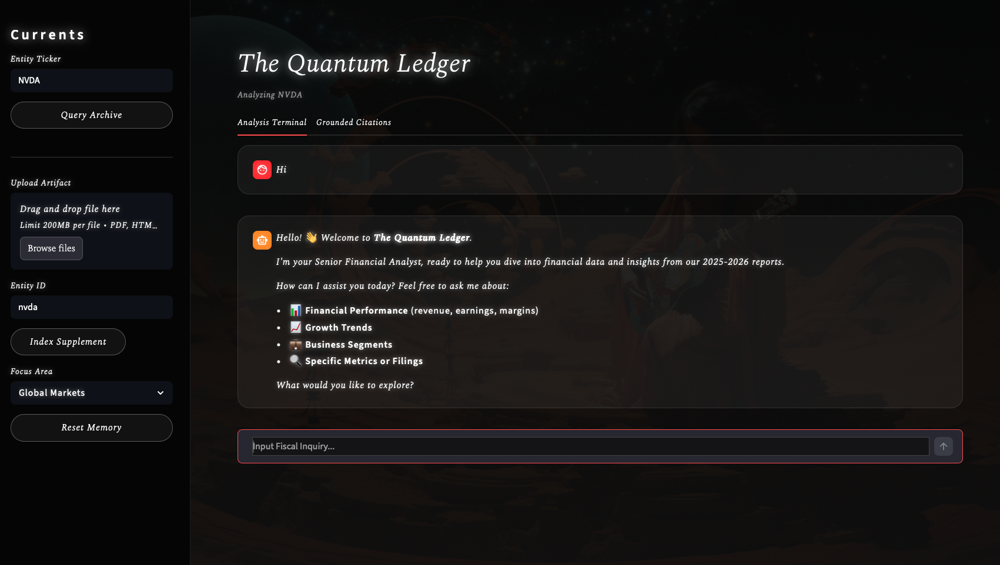

# 🌌 The Quantum Ledger: Dynamic Financial Intelligence

<p align="center">
  
</p>

**The Quantum Ledger** is a high-fidelity Retrieval-Augmented Generation (RAG) platform designed for real-time fiscal analysis. It transforms static financial documents—10-Ks, earnings transcripts, and management reports—into a dynamic, searchable intelligence graph. 

By leveraging **IBM Docling** for structural parsing and **Qdrant** for vector orchestration, the Ledger provides grounded, source-cited insights into the performance of major tech entities like **NVIDIA, Meta, Alphabet, Broadcom (AVGO),** and **TSMC**.

---

## 🏗️ Platform Features

### 🚀 **Dynamic Web Interface (Streamlit)**
A professional-grade dashboard for interactive querying and audit.
* **Quantum Hits Sidebar:** Real-time visibility into similarity scores and raw document chunks used for every answer.
* **Entity Filtering:** Toggle focus between specific companies or perform cross-sector "All" analysis.
* **Session Persistence:** Chat history and retrieval metadata are maintained throughout your research session.

### 🌐 **SEC "Golden Trio" Scout**
The Ledger features a universal discovery layer for US-listed equities. 
* **Auto-CIK Discovery:** Enter any ticker (e.g., `AVGO`, `ARM`, `SMCI`). The system automatically queries the SEC master directory to resolve Central Index Keys (CIKs) in real-time.
* **The Golden Trio Triage:** Automatically identifies and retrieves the three most critical artifacts for fiscal grounding: **10-K (Annual), 10-Q (Quarterly), and 8-K (Current/Earnings).**
* **Universal Support:** Native support for both Domestic (10-K/8-K) and Foreign Private Issuers (20-F/6-K).

### 📥 **Alpha-First Ingestion Logic**
A sophisticated ingestion pipeline designed to bypass legal "noise" and target high-value financial data.
* **Exhibit Prioritization:** The engine automatically hunts for **Exhibits 99.1 and 99.2** (CFO Commentary and Press Releases) before the main filing body, ensuring the AI is grounded in executive strategy.
* **Ghost Link Immunity:** Intelligent whitelisting ignores SEC navigation "ghost links" (404s), locking onto actual `.htm` and `.pdf` artifacts with 100% reliability.
* **Safety-Capped Chunking:** Optimized `RecursiveCharacterTextSplitter` logic ensures tables are preserved while staying strictly within the 512-token limits of high-performance embedding models.

### 📊 **Structural Intelligence (Table Parsing)**
Most LLMs treat financial tables as a "word soup." By leveraging **IBM Docling**, the Ledger preserves the structural hierarchy of financial matrices, ensuring that complex data is interpreted with relational accuracy.

---

## 🛠️ Tech Stack

| Component | Technology |
| :--- | :--- |
| **Interface** | Streamlit |
| **Search Service** | SEC EDGAR API w/ BeautifulSoup4 (XML) |
| **LLM** | Claude 3.5 Sonnet (Anthropic) |
| **Vector DB** | Qdrant (Dockerized) |
| **Parser** | IBM Docling |
| **Embeddings** | BAAI/bge-small-en-v1.5 |
| **Orchestration** | Python 3.12+ |

---

## 🚀 Getting Started

### 1. Prerequisites
Ensure you have **Docker** installed for the vector database and an **Anthropic API key** in your `.env`.

### 2. Installation & Launch
```bash
# Clone the repository
git clone [https://github.com/vasyloki/quantum-ledger.git](https://github.com/vasyloki/quantum-ledger.git)
cd quantum-ledger

# Set up environment
python3 -m venv venv
source venv/bin/activate
pip install -r requirements.txt

# Spin up the Qdrant engine
docker run -p 6333:6333 qdrant/qdrant

# Launch the Platform
streamlit run app.py
```
---

## 🔍 How to use the Scout

1. **Enter a ticker** in the sidebar (e.g., `NVDA` or `AVGO`).
2. **Click 🔍 Scout Trio** to see the latest 2026 filings.
3. **Click 📥 Ingest to Ledger** on a specific filing. The system will automatically target the **CFO Commentary (Ex 99.1)** first.
4. **Grounded!** Once you see the notification, your Ledger is updated with that company's specific fiscal context.

---

## 🛡️ The Hallucination Firewall

General LLMs often "hallucinate" by blending pre-training data with your documents. The Ledger utilizes **Hard Grounding**, physically restricting the LLM's context to only the specific data points retrieved from your private Qdrant vault.

* **Audit-Ready Verifiability:** Every response is tethered to a "Quantum Hit."
* **Deterministic Retrieval:** If the fact isn't in your Ledger, the system is instructed to state it doesn't know rather than "guessing."
* **Relational Integrity:** By preserving table structures, we prevent the "word soup" effect that leads to incorrect fiscal constant extraction.